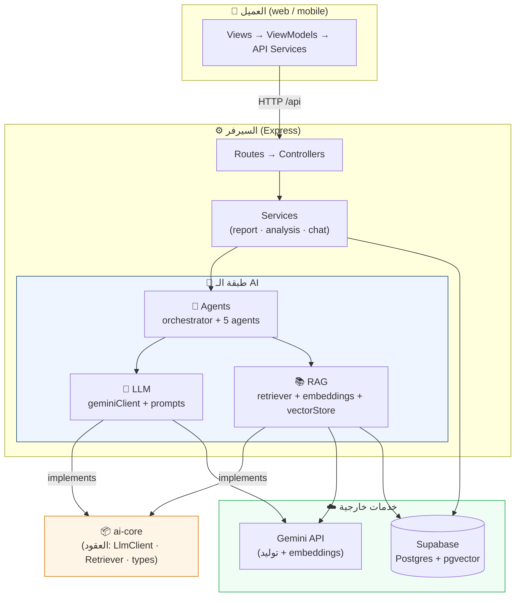
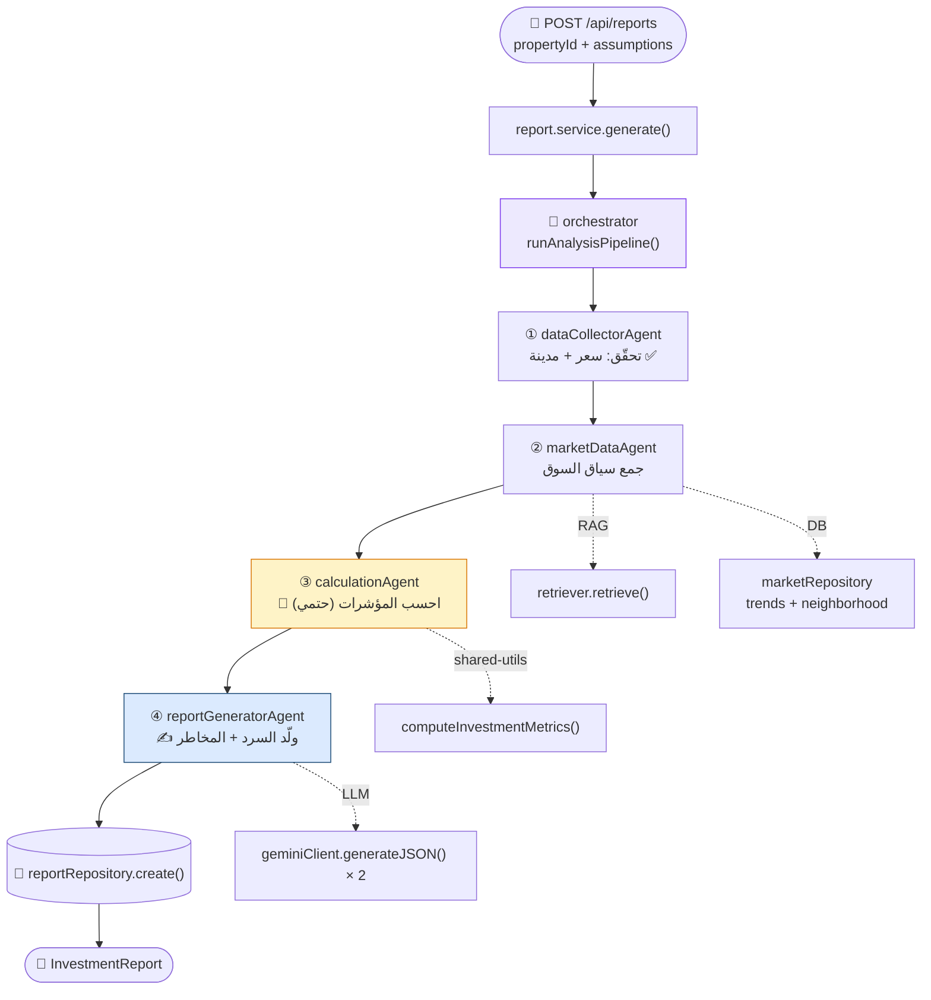
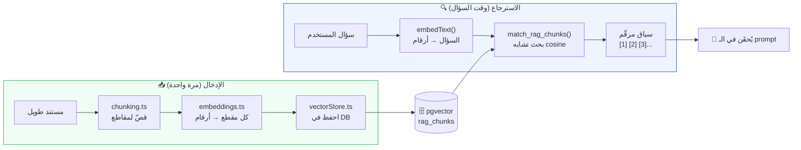
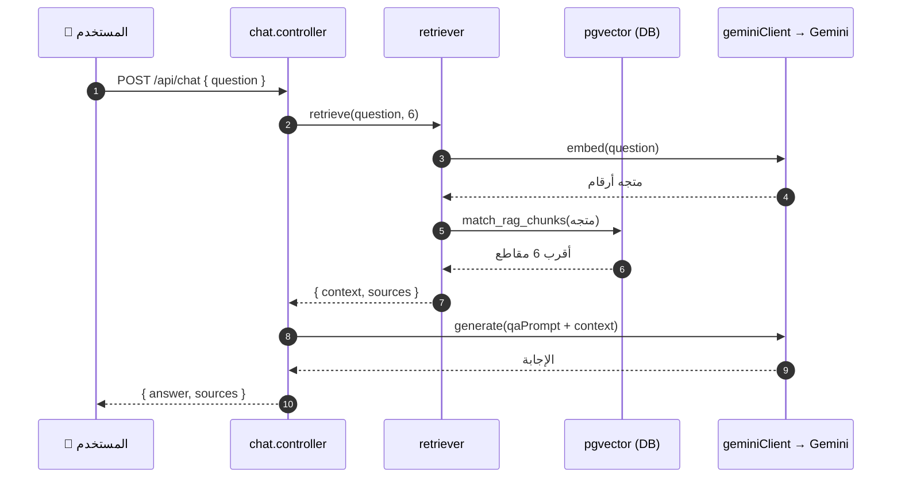
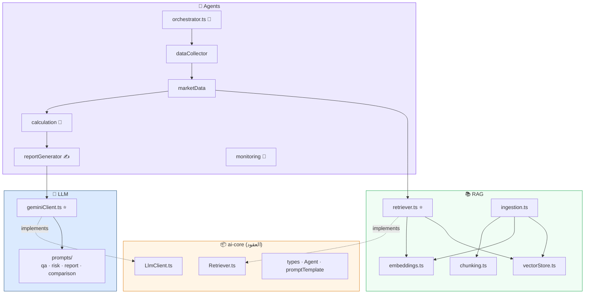

# 🧠 PropertyPulse — AI System Diagrams

> رسومات بصرية لنظام الـ AI. بتتعرض مباشرة في VSCode (Markdown Preview) و GitHub.
> لو مش ظاهرة في VSCode، ثبّت إضافة **"Markdown Preview Mermaid Support"**.

---

## 1) المعمارية بالطبقات (Layers)

---

## 2) خط توليد التقرير (Report Pipeline) — القلب ⭐

> 🔑 **القاعدة الذهبية:** الخطوة ③ (المحاسب) بتحسب الأرقام بالكود.
> الخطوة ④ (الكاتب/LLM) بتشرح بس وما تخترعش أرقام.

---

## 3) إزاي الـ RAG شغّال (البحث الدلالي) 📚

---

## 4) مسار المحادثة (Chat / Q&A) 💬

---

## 5) خريطة الملفات → الطبقات

---

## 🎨 دليل الألوان

| اللون | الطبقة |
|------|--------|
| 🟠 برتقالي | `ai-core` — العقود المجرّدة |
| 🔵 أزرق | طبقة الـ LLM (التوليد) |
| 🟢 أخضر | طبقة الـ RAG (المعرفة) |
| 🟣 بنفسجي | طبقة الـ Agents (التنسيق) |
| 🟡 أصفر | الحسابات الحتمية (مش من الـ LLM) |
